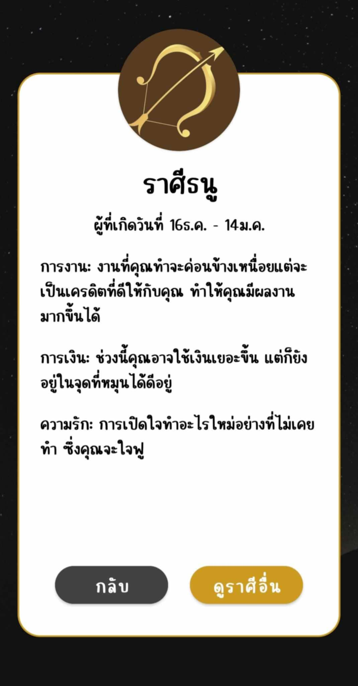
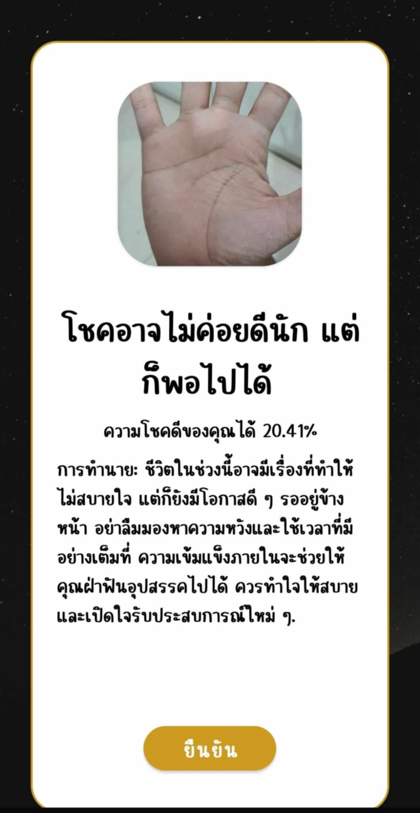

# 🔮 DuangDee Android App (Kotlin)

**DuangDee** is a fortune-telling Android application developed using **Kotlin**, designed to deliver various types of spiritual predictions including **palmprint reading**, **tarot card reading**, and **birthday-based forecasts**. The app also provides **daily horoscope results** with a user-friendly interface.

This project was developed as part of a university assignment in **Year 3, Semester 1**.

---

## 🚀 Key Features

- ✋ **Palmprint Prediction** – Capture palm images and get predictions using a machine learning model
- 🃏 **Tarot Card Reading** – Draw cards and receive spiritual insights
- 🎂 **Birthday Horoscope** – Analyze zodiac-based predictions using birth date
- 📅 **Daily Horoscope** – Daily astrological summary personalized for the user
- 👤 User authentication and profile system
- 🔗 Connects to backend APIs and ML models

---

## ⚙️ System Architecture

The system is divided into **3 major parts**:

| Layer | Description |
|-------|-------------|
| **Frontend (Mobile)** | Kotlin-based Android app using Jetpack libraries |
| **Backend (Node.js)** | RESTful API handling user data, tarot, birthday, daily horoscopes |
| **AI Engine (Python)** | Palmprint recognition and prediction served via Python API |

---

## 🧰 Tech Stack

### 💻 Frontend (Android)

- Kotlin
- ViewModel, LiveData, Retrofit2
- Coroutines for asynchronous tasks
- Glide for image loading
- Material Design UI components
- **Designed with Figma**

### 🌐 Backend (API)

- Node.js + Express
- JWT Authentication
- MySQL
- REST API for horoscope, tarot, and user handling

### 🧠 AI Module

- Python (Flask)
- OpenCV or TensorFlow/Keras (for palmprint analysis)
- Trained model hosted separately from backend server

---

## 📸 Screenshots (Placeholder)

> Add real UI screenshots here from the app (designed in Figma and implemented in Android)

| Main Screen | Profile Screen | Menu Screen | Game Screen | Horoscope Screen | Palmprint Screen |
|------|--------------|--------|-----------|-----------|-----------|
|  |  |  |  |  |  |

---

## 📁 Folder Structure (Mobile App)

